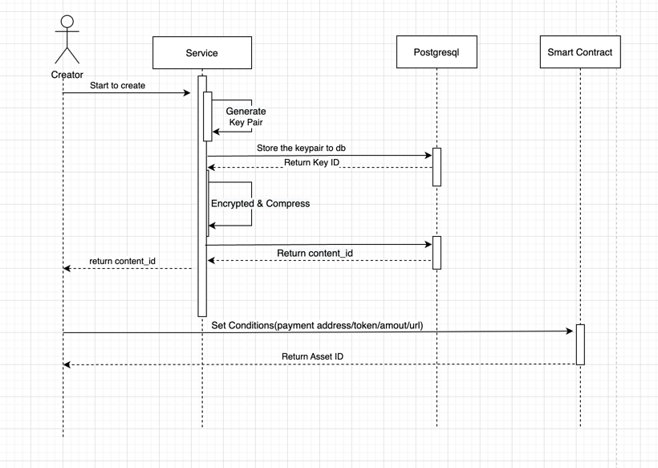
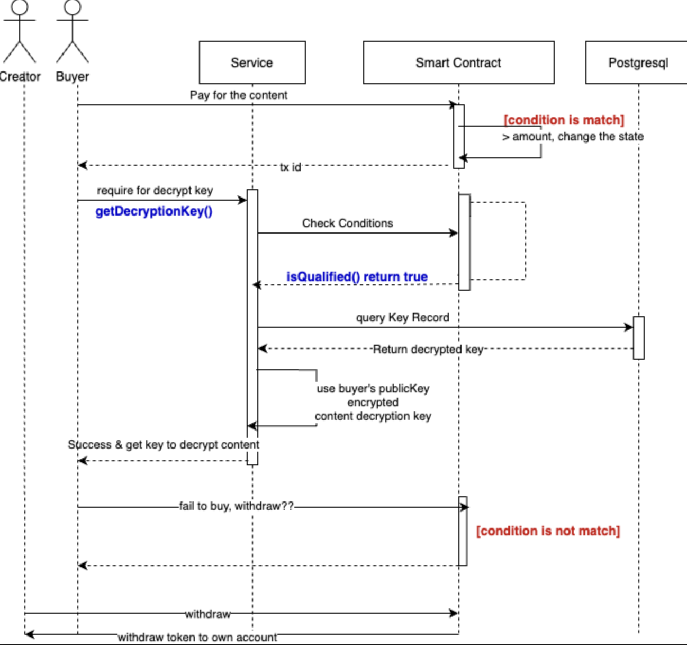

# CreatorSuite
CreatorSuite is designed to be a useful tool in Core Service to help content creator to distribute their content.

## CreatorSuite Service

### CreatorSuite Service API
CreatorSuite defined two api to implement the functions of list content asset and distribute content.

[API doc](https://github.com/nextdotid/creator_suite/tree/main/docs/api.apib)

With the API of create, creator's work flow will be like:

With the API of get-content, the workflow will be like:

### CreatorSuite Service Database
CreatorSuite Service needs two tables that help to record listed content assets.
One is key_record, when the creators choose to use symmetric encryption to encrypt their content assets, they need to create the key first.

| Field      | Type           | Description |
|------------|----------------|-------------|
| id         | auto_increased | int         |
| password   |                | string      |
| created_at |                | datetime    |
| updated_at |                | datetime    |

The other one is Content， which is the record of content assets

| Field            | Type           | Description |
|------------------|----------------|-------------|
| id               | auto_increased | int         |
| location_url     | string         |             |
| managed_contract | string         |             |
| chain            | string         |             |
| creator_address  | string         |             |
| encryption_type  | string         |             |
| file_extension   | int            |             |
| key_id           | int            | FK          |
| created_at       | datetime       |             |
| updated_at       | datetime       |             | 
|                  |                |             |